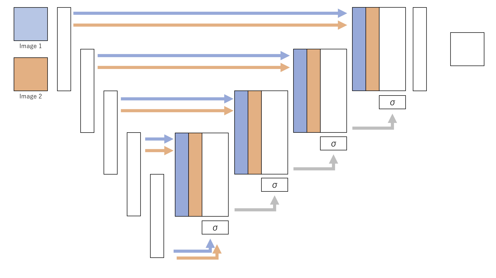
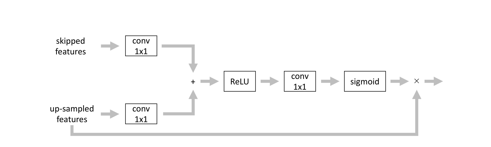

# Siamese Attention U-Net for Multi-Class Change Detection
1st place solution for the EARTHVISION 2021 DynamicEarthNet Challenge - Weakly-Supervised Multi-Class Change Detection Track at CVPRW 2021  
[[Challenge Site]](https://competitions.codalab.org/competitions/30441) 
[[Presentation Slides]](./examples/earthvision2021_presentation.pdf) 
[[Presentation Video]](https://youtu.be/nrntHeY8vtg?t=11994)

## Overview
This work introduces a pixel-wise change detection network named Siamese Attention U-Net that incorporates attention mechanisms in the Siamese U-Net architecture. Experiments show the architectural change alongside training strategies such as semi-supervised learning produce more robust models.  
  


### Results
1. Attention block  



When training the model with Jaccard loss, attending the up-sampled features improves mean IoU scores whereas attending skipped features - originally proposed in Attention UNet - do not. The improvement implies a need for prioritizing information in the coarser resolution features.

|Attended features|mean IoU (val)|
|:-:|:-:|
|None|0.2635|
|Skipped features|0.2603|
|Up-sampled features|0.2658|

2. Loss function  

Jaccard loss and Dice loss optimize for different metrics, producing slightly varying results. Ensembling models trained exclusively on each loss function improves scores.

|Loss function|mean IoU (val)|
|:-:|:-:|
|Jaccard|0.2658|
|Dice|0.2668|
|Ensemble|0.2676|

3. Semi-supervised learning  

Creating hard pseudo labels for the public validation and test dataset, then retraining the model alongside the original training dataset improves scores regardless of loss function. The ensemble of models trained on each loss function is submitted to the public test benchmark.

|Pseudo labels|Loss function|mean IoU (val)|mean IoU (test)|
|:-:|:-:|:-:|:-:|
|None|Jaccard|0.2658||
|val+test|Jaccard|0.2669||
|None|Dice|0.2668|
|val+test|Dice|0.2674||
|None|Ensemble|0.2676||
|val+test|Ensemble|0.2684|0.2423|


## Usage
### Dependencies
- gdal
- numpy
- pandas
- pillow
- pytorch
- pyyaml
- torchvision
- tqdm

### Downloading and Preprocessing Data
```bash
# assumes all data is unzipped to ./earthvision2021/data/source/
cd ./setup/
# convert data and organize directories
bash setup.bash
```
```bash
cd ./earthvision2021/preprocessing/
# create csv file that determines crop regions for training
python crop.py
mv train.csv ../data/train/random_128_binary_attempts128.csv
```

### Training
```bash
cd ./earthvision2021/
# train model according to configurations in ./earthvision2021/config_train.yml
python train.py
```

### Predicting
```bash
cd ./earthvision2021/
# predict using model according to configurations in ./earthvision2021/config_predict.yml
python predict.py
```

### Pseudo Labelling 
```bash
cd ./earthvision2021/postprocessing/
# binarizing prediction results to create hard pseudo labels
python label_binarize.py --in_dir ${prediction_dir}
cd ../preprocessing/
# create new csv file of crop regions
python crop.py --subset_file ${filename_text_file}
mv train.csv ../data/train/${csv_file}
# change "aoi_file" in ../config_train.yml to ${csv_file} and retrain
```

### Postprocessing
```bash
cd ./earthvision2021/postprocessing/
# ensemble multiple predictions results
python ensemble.py --in_dir_list ${prediction_dir} ...
# binarize prediction results
python binarize.py --in_dir ${prediction_dir}
```

